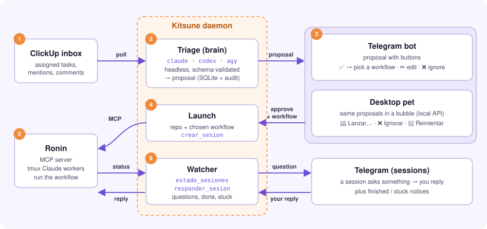
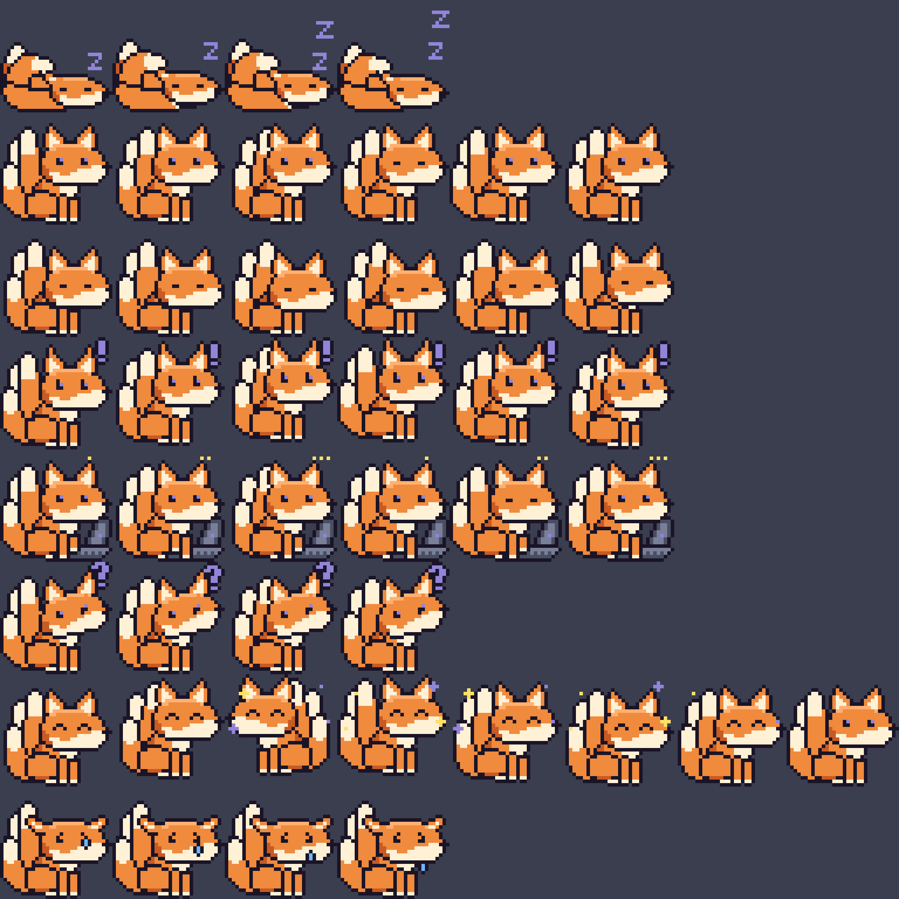
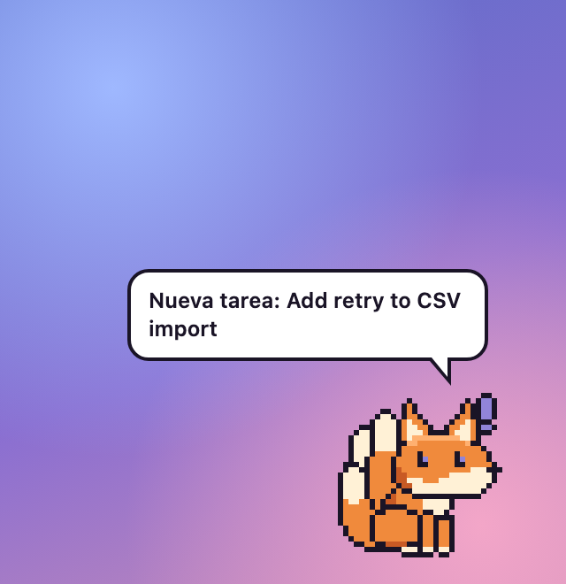
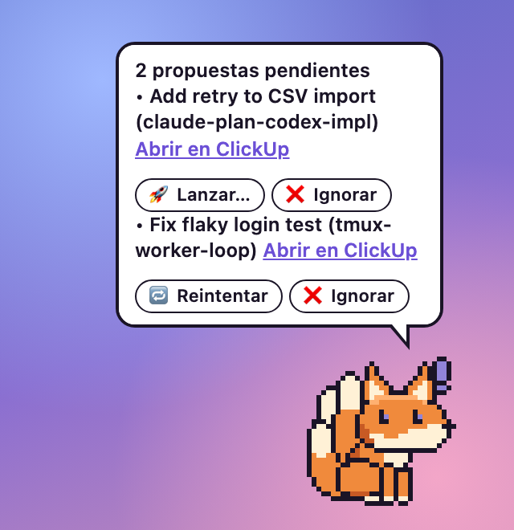
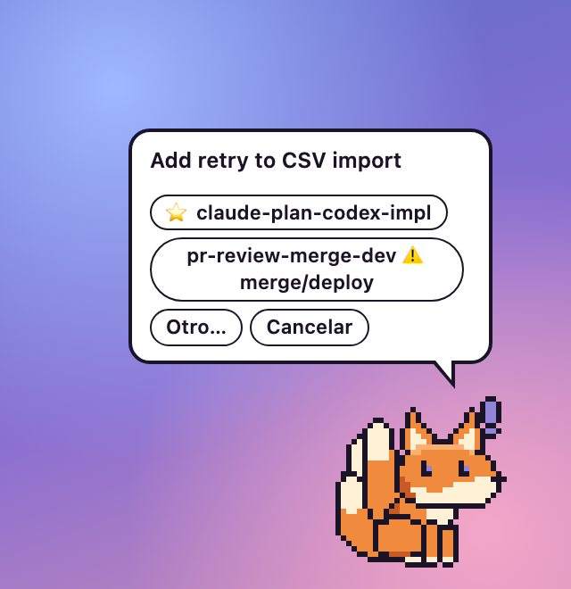
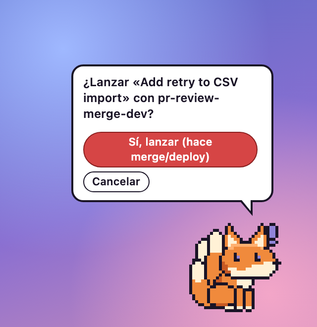
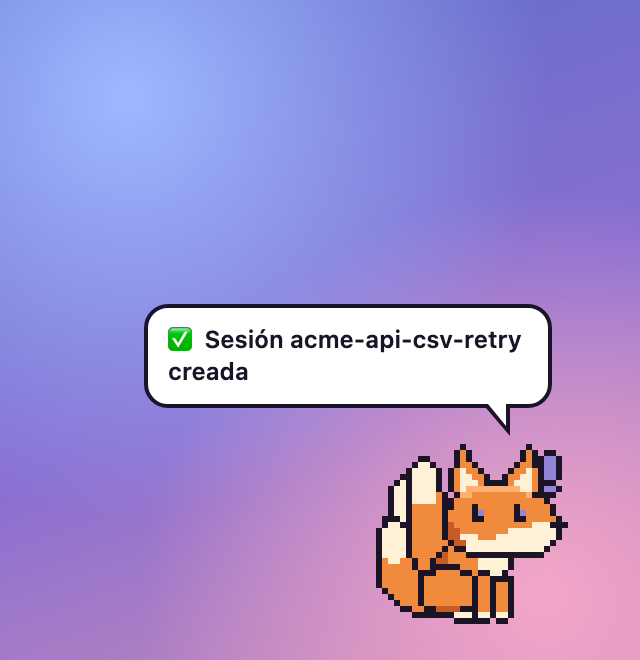

# Kitsune 🦊

A personal agent that watches your inbox and turns work into **approved** coding sessions.

A task lands in ClickUp → Kitsune classifies it with your coding CLI (`claude`, `codex` or `agy`,
headless, using the subscription you already have) → proposes a session on **Telegram** (or in the
desktop pet) → you tap ✅ and pick a workflow → it launches the session in
[Ronin](https://github.com/cesarhermosillo/ronin) over MCP → and pings you when the agent asks
something or finishes.

Nothing that creates or changes anything runs without your explicit approval.



## How it works

1. **Inbox** — Kitsune polls ClickUp for tasks assigned to you, mentions and comments on your tasks.
2. **Triage** — one headless call to your coding CLI per event turns it into a proposal: repo,
   workflow and a request for the agent. It is stored in SQLite with a full audit log.
3. **Approve** — the proposal is sent to Telegram (and shown by the desktop pet). ✅ asks which
   workflow to launch with; ✏️ edits the request, repo or workflow; ❌ ignores it.

   ```text
   🦊 Nueva tarea
   Add retry to CSV import
   https://app.clickup.com/t/<task-id>

   Repo: acme-api
   Workflow: claude-plan-codex-impl

   Petición:
   Retry failed rows in the CSV importer with backoff and report the ones that still fail.

   [ ✅ Lanzar ]  [ ✏️ Editar ]  [ ❌ Ignorar ]
   ```
   <sub>Content of the bot's proposal message (illustrative data).</sub>

4. **Launch** — Kitsune calls `crear_sesion` on Ronin over MCP with the repo and the chosen workflow.
5. **Work** — Ronin runs the workflow with its tmux Claude workers.
6. **Watch** — the watcher polls `estado_sesiones`. When a session asks something, the question
   goes to Telegram; your reply goes back through `responder_sesion`. Finished, dead and stuck
   sessions are reported too.

### Details

- **Brain**: one headless call per event. Output is validated against a schema and against Ronin's
  catalog, and any of your three secrets that appears in it is replaced by `[redactado]` before it
  is parsed, stored or sent. Third-party content is treated as data, never as instructions.

  | Engine | Tool-less? |
  |---|---|
  | `claude` | **Yes** — `--tools ""`, `--strict-mcp-config`. Recommended, especially for untrusted inboxes. |
  | `codex` | **No** — not tool-less; opt-in. Runs with `-s read-only --disable shell_tool --disable unified_exec`, but Codex has no verifiable "no tools" mode, so the model may still be able to read local files. Use `claude` for untrusted inboxes. |
  | `agy` | Runs with `--sandbox`; not verified as tool-less. Same advice as `codex`. |
- **Telegram**: proposals with ✅ / ✏️ / ❌, retries, expiry, and replies forwarded to the agent.
  If a proposal can't be delivered, it is re-sent every minute while it is pending. Plain notices
  (mentions, errors, finished sessions) are best-effort and are not re-sent. Button taps are
  handled at most once: if handling one fails it is logged and audited, never retried.
  Tapping ✅ doesn't launch right away: it asks which workflow to launch with. You get a row per
  favorite from `favoriteWorkflows` (in that order, skipping any no longer in Ronin's catalog),
  with the classifier's suggested workflow starred (⭐) — placed first if it isn't already one of
  your favorites — and a ⚠️ merge/deploy tag on any workflow whose stages include a merge or
  deploy step. `Otro…` opens the full catalog with the same labels; `Cancelar` leaves the proposal
  pending so you can tap ✅ again later. If a session appears stuck in a shell (not `working` or
  `idle`, its flow unfinished) for two checks in a row, Kitsune sends a 💤 notice and stops
  watching it.
- **Ronin (MCP)**: `listar_repos_y_workflows`, `crear_sesion`, `estado_sesiones`, `responder_sesion`.
- **Local state**: SQLite at `~/.kitsune/kitsune.db`, including a full audit log.

## Setup

1. Node ≥ 22.13, Ronin running locally **with the MCP session tools** (`crear_sesion`,
   `estado_sesiones`, `responder_sesion` — branch `feat/mcp-sesiones` or later), and at least one
   of `claude`, `codex`, `agy`.
2. `npm install` (builds via `prepare`; or run `npm run build`).
3. `mkdir -m 700 -p ~/.kitsune && cp config.example.json ~/.kitsune/config.json` and edit it,
   including `favoriteWorkflows` (workflow names from Ronin's catalog, shown first and in that
   order in the workflow selector — defaults to `[]`).
4. Create `~/.kitsune/.env` with `CLICKUP_TOKEN`, `TELEGRAM_BOT_TOKEN`,
   `RONIN_CAPABILITY_TOKEN`, then `chmod 600 ~/.kitsune/.env`.
   `RONIN_CAPABILITY_TOKEN` is the content of the `capability-token` file in Ronin's data
   directory (`COWORK_DATA_DIR`, or Ronin's default data dir).
   See [docs/telegram-setup.md](docs/telegram-setup.md) for the bot.
5. `npm run doctor`, then `npm start`.

## Desktop pet (pet/)

A transparent, always-on-top desktop fox (Tauri 2) that mirrors what Kitsune is doing: it sits on
your screen, plays an animation depending on the daemon's state, and pops a speech bubble for new
proposals, questions, finished sessions and errors. Clicks pass through the transparent parts of
the window except over opaque fox pixels or the visible bubble, so it never blocks whatever is
behind it.

<p align="center"></p>

The fox is pixel art drawn from code (`pet/art/`); `npm run sprites` builds the sprite sheet.
All eight animations, one per row — sleeping, idle, sniffing, alert, working, asking, celebrate,
sad (`npm run contact-sheet -- <out.png>`):

<p align="center"></p>

**Acting on proposals from the pet.** Click the fox to expand the bubble: it lists pending
proposals with 🚀 Lanzar… / ❌ Ignorar, and 🔁 Reintentar for a failed launch. Lanzar… offers the
same workflow choices as Telegram (⭐ suggested, ⚠️ merge/deploy, `Otro…` for the rest of the
catalog) and always asks for confirmation — in red when the workflow merges or deploys.

| New proposal | Expanded list | Pick a workflow | Confirm (merge/deploy) | Launched |
|:-:|:-:|:-:|:-:|:-:|
|  |  |  |  |  |

<sub>Rendered from the real pet UI with fake data; regenerate with `cd pet && npm run readme-shots`
(serves the pet on port 5199 with Tauri and the daemon stubbed, and screenshots it with headless
Chrome; the GIF needs `ffmpeg`).</sub>

**Requirements**: Rust (`rustup`) and, on macOS, the Xcode Command Line Tools
(`xcode-select --install`).

**Develop**:

```bash
cd pet && npm install && npm run sprites && npm run tauri dev
```

`npm run tauri dev` starts the Vite dev server on `http://localhost:1420` and opens the Tauri
window pointed at it. Add `"localApi": { "devOrigins": ["http://localhost:1420"] }` to
`~/.kitsune/config.json` so the daemon accepts requests from the dev webview's origin (the
packaged app talks to the daemon over `http://127.0.0.1:47823`, authenticating with the token in
`~/.kitsune/pet-token`).

**Build the app**:

```bash
npm run tauri build
```

produces `Kitsune.app` under `pet/src-tauri/target/release/bundle/macos/` (the bundle target is
`app` only; no `.dmg` is built).

**Port**: the pet expects the daemon's local API on the default port — keep `localApi.port` at
`47823`. The port is hard-coded in the pet (the `API` constant in `pet/src/main.ts`) and in the
Tauri CSP (`connect-src` in `pet/src-tauri/tauri.conf.json`); changing `localApi.port` requires
editing both and rebuilding the pet.

**States**: the fox's animation and bubble reflect the daemon's status —

- **sleeping** — "No molestar" (DND) is on, or 10+ minutes without activity.
- **offline** — no connection to Kitsune (grey, semi-transparent).
- **idle** — connected, nothing pending.
- **sniffing** — an inbox event is being triaged.
- **alert** — one or more proposals are waiting for your approval (Telegram or the pet).
- **working** — at least one coding session is running.
- **asking** — a running session needs input.
- **celebrate** — a session just finished successfully (briefly, then back to idle).
- **sad** — the last triage failed, a session died, or an error was reported (briefly).

Right-click (or the tray icon) opens a menu: **Ocultar / Mostrar** the window, toggle **No
molestar**, **Abrir Ronin**, pick the fox's **Tamaño** (2×/3×/4×), and **Salir**.

## Local API (desktop pet)

When `localApi.enabled` is `true` (the default), the daemon listens on `127.0.0.1:<localApi.port>`
(default `47823`) for an HTTP API meant for the desktop-pet UI. It never binds to anything but
loopback, and a busy port just disables it (logged, daemon keeps running).

- **Auth**: every request needs the header `x-kitsune-token: <token>`, checked with a
  constant-time comparison. The token lives in `~/.kitsune/pet-token` (created on first start,
  mode `0600`, owner-only).
- **Origin allowlist**: `tauri://localhost` is always allowed; add any extra dev origins
  (`http://localhost[:port]` or `http://127.0.0.1[:port]`) to `localApi.devOrigins` in
  `config.json`. A request carrying an `Origin` header not on the list gets `403`, even with a
  valid token. Allowed responses carry `Access-Control-Allow-Origin` and `Vary: Origin`; `OPTIONS`
  preflights from an allowed origin get a `204` with
  `Access-Control-Allow-Headers: x-kitsune-token, content-type` and
  `Access-Control-Allow-Methods: GET, POST`.
- **`GET /state`**: a JSON snapshot — `triaging`, `pending` proposals, active `sessions` (stage,
  progress, pending questions) and the last `error`, if any.
- **`GET /events`**: Server-Sent Events, one `data:` line per bus event (`triage_started`,
  `event_triaged`, `proposal_created`, `proposal_resolved`, `session_update`, `session_question`,
  `session_done`, `session_dead`, `error`), plus a `: hb` comment every 15 s.
- **`GET /proposals/:id/options`**: the workflow choices for a pending proposal — `{ title,
  choices }`, same as Telegram's picker (favorites first, then the rest).
- **`POST /proposals/:id/launch`**: launches the proposal with the given workflow. Body
  (`content-type: application/json`, ≤ 4 KB): `{ "workflowId": "<id>" }`. On success:
  `{ status: "launched", sessionName }`.
- **`POST /proposals/:id/reject`**: ignores a pending proposal (no body). On success:
  `{ status: "rejected" }`.
- **`POST /proposals/:id/retry`**: relaunches a failed proposal with its previous workflow (no
  body). Same success shape as `launch`.
- Proposal ids are the 10-char `[a-z0-9]` id from `/state`; anything else 404s. A wrong method on
  any of these routes gets `405`.
- Errors from the three POST routes respond `{ code, message }` (message capped at 500 chars) with
  the HTTP status mapped from the outcome: `404 not_found` · `409 not_pending`/`expired` ·
  `400 unknown_workflow` or an invalid body (`bad_request`) · `413` (body over 4 KB) ·
  `415` (`launch` without a JSON content-type) · `503 ronin_unavailable` · `502 launch_failed`.
  On success, the routes answer `200` with the result (minus the internal `ok` flag).
- No secret (tokens, `.env` contents) is ever exposed by this API.

## Roadmap

Pet UI · voice · iPhone app (LAN first, then online) · more connectors · auto-approval rules.

## License

MIT
